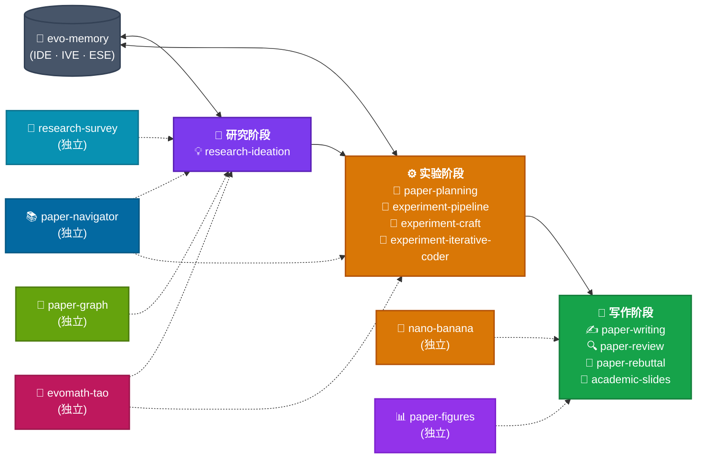

> [!WARNING]
> 这是社区翻译版本，欢迎修正！

---

# 🧬 EvoSkills

<div align="center">

**[English](./README.md) | 简体中文**

</div>

**[EvoScientist](https://github.com/EvoScientist/EvoScientist) 的官方技能仓库。每个技能都是一个可安装的知识包，为 EvoScientist 扩展领域专精能力。**

## 📦 安装

> [!IMPORTANT]
> 这些技能专为 EvoScientist 打造——它们彼此增益，共同释放智能体与技能的全部潜力。在 EvoScientist 中，技能通过持久记忆（evo-memory）跨研究周期不断进化。

### 会话内命令

一次性安装所有技能：

```bash
/install-skill EvoScientist/EvoSkills@skills
```

或安装单个技能：

```bash
/install-skill EvoScientist/EvoSkills@skills/paper-planning
```

### 直接询问 EvoScientist

直接在对话中让智能体安装：

```text
"Install all skills from EvoScientist/EvoSkills@skills."
```

> [!TIP]
> **不使用 EvoScientist？** 这些技能兼容任何编码智能体。
> 通过 [**skills.sh**](https://skills.sh/) 一条命令即可安装到 Claude Code、OpenCode、Cursor、Codex、Gemini CLI、DeepAgents 等：
> ```bash
> npx skills add EvoScientist/EvoSkills
> ```


## ✨ 技能一览

| 技能 | 描述 |
| ----- | ----------- |
| [`research-ideation`](#-research-ideation--文献锚定锦标赛与研究提案) | 💡 文献锚定、锦标赛排名与研究提案生成 |
| [`paper-planning`](#-paper-planning--论文规划与大纲生成) | 📐 论文规划与大纲生成 |
| [`experiment-pipeline`](#-experiment-pipeline--四阶段实验执行) | 🧪 结构化四阶段实验执行 |
| [`experiment-craft`](#-experiment-craft--实验调试与迭代) | 🔧 实验调试、日志记录与迭代 |
| [`experiment-iterative-coder`](#-experiment-iterative-coder--迭代式代码精炼) | 🔄 迭代式代码精炼（规划 → 编码 → 评估 → 精炼） |
| [`paper-writing`](#%EF%B8%8F-paper-writing--逐节论文撰写) | ✍️ 端到端论文写作辅助 |
| [`paper-review`](#-paper-review--自审与质量保障) | 🔍 自动化论文审阅与反馈 |
| [`paper-rebuttal`](#-paper-rebuttal--同行评审后的-rebuttal-撰写) | 💬 同行评审后的 Rebuttal 撰写 |
| [`paper-figures`](#-paper-figures--从数据生成出版级-matplotlib-图表) | 📊 从表格数据生成出版级 matplotlib 图表 |
| [`academic-slides`](#-academic-slides--学术演示与报告制作) | 🎤 学术演示与研究报告制作 |
| [`evo-memory`](#-evo-memory--持久研究记忆与自我进化) | 🧠 持久研究记忆与自我进化 |
| [`paper-navigator`](#-paper-navigator--学术论文发现与阅读) | 📚 学术论文发现、评估与阅读 |
| [`research-survey`](#-research-survey--文献综述与整合) | 📝 结构化文献综述整合 |
| [`paper-graph`](#-paper-graph--用-mermaid-图谱绘制研究领域脉络) | 🌳 以 Mermaid 图谱呈现研究领域脉络 |
| [`nano-banana`](#-nano-banana--ai-生成幻灯片与插图) | 🍌 基于 Gemini 的 AI 幻灯片与插图生成 |
| [`evomath-tao`](#-evomath-tao--陶哲轩式奥数证明工作流) | 🧮 陶哲轩式奥数级证明工作流，支持校准弃答 |

> **论文套件 + 自我进化套件**：每个技能都是自包含的——可单独使用，也可自由组合。自我进化循环现在贯穿 `research-ideation`、`experiment-pipeline` 与 `evo-memory`。

## 🔌 MCP 服务器市场

[`mcp/`](./mcp/) 目录收录了一组精选的 [MCP](https://modelcontextprotocol.io/) 服务器，为智能体扩展外部工具——网络搜索、学术论文检索、文档查询等。浏览[完整列表](./mcp/README.md)，或直接安装：

```bash
/install-mcp              # 交互式浏览
EvoSci mcp install arxiv  # 按名称安装
```

### ⛳️ 框架总览

<p align="center">
  
</p>

上图展示了完整的 EvoScientist 流水线。**Researcher Agent**（上方，蓝色）运行想法树搜索与 Elo 锦标赛排名，产出研究提案。**Engineer Agent**（下方，绿色）执行四阶段实验流水线。**Evolution Manager Agent**（右侧）管理三种记忆进化机制——IDE、IVE 与 ESE——将学到的知识回馈到 **Ideation Memory (M_I)** 与 **Experimentation Memory (M_E)**，供后续研究周期使用。

#### 🎢 技能流水线



---

### 💡 `research-ideation` — 文献锚定、锦标赛与研究提案

研究流水线的起点。现已覆盖从文献锚定、想法排名到具体提案的完整路径：

- **加载先验知识** — 先读取 `evo-memory`，复用可行方向并避开已知死胡同
- **文献锚定** — 在生成想法前，使用 `paper-navigator` 收集并分析论文
- **多轨道构思 + 精炼** — 以多种研究者角色生成候选想法，再迭代强化
- **Elo 锦标赛** — 按新颖性、可行性、相关性与清晰度为精炼后的想法排名，呈现前三名
- **提案扩展** — 将胜出的想法扩展为达到稿件质量的研究提案

### 📝 `research-survey` — 文献综述与整合

将大规模论文集合转化为结构化综述报告的专用技能：

- **自适应大纲** — 根据查询类型与文献集合生成领域定制的大纲
- **草稿 + 扩写流水线** — 先基于核心论文起草，再用完整文献集深化每一节
- **摘要精炼** — 先构建分节小结，再重写摘要、引言与结论
- **综述级输出** — 对比表格、基于分类体系的方法组织、密集引用与参考文献

### 📐 `paper-planning` — 论文规划与大纲生成

在动笔之前引导完成写作前规划。涵盖四项关键活动：

- **故事设计** — 逆向工程叙事：任务 → 挑战 → 洞察 → 贡献 → 优势
- **实验规划** — 用结构化清单规划对比实验、消融实验与演示场景
- **图表设计** — 突出新颖性的流水线图；吸引审稿人的 teaser 图
- **时间线管理** — 从大纲到投稿的四周倒计时排期

包含反直觉策略：先写自己的拒稿信、先收窄论断再扩展、提前规划后备叙事。

### 🧪 `experiment-pipeline` — 四阶段实验执行

带尝试预算与阶段门控条件的结构化实验执行框架：

- **Stage 1：初始实现** — 跑通基线代码并复现已知结果（≤20 次尝试）
- **Stage 2：超参数调优** — 针对你的环境优化配置（≤12 次尝试）
- **Stage 3：提出的方法** — 实现并验证新方法（≤12 次尝试）
- **Stage 4：消融实验** — 证明每个组件的贡献（≤18 次尝试）
- **代码轨迹日志** — 结构化的尝试日志，回馈给 `evo-memory`
- **反直觉规则** — 初始实现不是浪费时间；预算上限防止钻牛角尖；失败的尝试也是数据

与 `experiment-craft` 集成以在阶段内诊断失败，与 `evo-memory` 集成以实现跨周期学习。

### 🔧 `experiment-craft` — 实验调试与迭代

实验调试、日志记录与迭代改进的系统方法：

- **五步诊断流程** — 收集失败信息 → 找到可用版本 → 弥合差距 → 提出假设 → 修复
- **反直觉规则** — 一次只改一个变量；有效的实验胜过更多的实验
- **实验日志** — 五段式结构化日志模板，保证记录可复现
- **移交 paper-writing** — 将验证过的结果与日志交给 `paper-writing` 起草论文

### 🔄 `experiment-iterative-coder` — 迭代式代码精炼

以结构化的“规划 → 编码 → 评估 → 精炼”循环提升代码质量：

- **阶段分解** — 将复杂任务拆分为 1-5 个顺序阶段
- **迭代循环** — 每阶段最多 3 次迭代（总计 10 次）：规划、编码、运行 lint/测试、打分、决策
- **客观评估** — ruff lint + pytest，动态分数加权与硬性上限
- **失败模式指引** — 针对超时、语法、导入、测试与 lint 失败的针对性应对

与 `experiment-craft` 集成以诊断卡壳问题，与 `evo-memory` 集成以加载既有策略。

### ✍️ `paper-writing` — 逐节论文撰写

久经验证的 11 步学术论文写作工作流，附 LaTeX 模板：

- **结构化流程** — 从流水线草图 → 故事设计 → Method → Experiments → Related Work → Abstract → Title
- **分节模板** — 三种 Abstract 模板、四种 Introduction 开篇、Method 模块结构、Experiments 组织方式
- **LaTeX 资产** — 带注释的论文骨架（`paper-skeleton.tex`）与 booktabs 表格宏（`table-style.tex`）
- **写作原则** — 一段一个信息点、主题句先行、术语一致性、反向大纲
- **反直觉策略** — 行文低调声明 / 证据超额兑现；先讲机制，而不只是指标

### 🔍 `paper-review` — 自审与质量保障

投稿前的系统化自审，采用对抗式与反直觉审稿策略：

- **五维检查清单** — 贡献充分性、写作清晰度、结果质量、测试完整性、方法设计
- **反向大纲** — 从成稿段落中提取大纲，验证逻辑流
- **图表质量检查** — 图注、分辨率、booktabs、色盲友好性
- **拒稿模拟** — 先强制写一份拒稿摘要；攻击自己的新颖性论断
- **移交 Rebuttal** — 审阅结束后，将发现的弱点交给 `paper-rebuttal` 准备回应

### 💬 `paper-rebuttal` — 同行评审后的 Rebuttal 撰写

同行评审后回应审稿人意见的专用 Rebuttal 技能：

- **评分诊断** — 给每条审稿意见着色：红色（致命）、橙色（重要）、灰色（次要）、绿色（正面）
- **Champion 策略** — 为最支持你的审稿人提供证据，助其在 Area Chair 讨论中为你发声
- **战术性写作** — 关于 Rebuttal 结构、内容与语气的 18 条规则
- **反直觉原则** — 即使分数极端也要提交；在小问题上让步，赢下核心论点
- **常见质疑** — 针对 12 类高频审稿意见的回应策略

### 📊 `paper-figures` — 从数据生成出版级 Matplotlib 图表

规格优先的工作流，将 CSV 与自然语言描述转化为独立 PNG 与可复现的 matplotlib 脚本：

- **六步协议** — 规划图表 → 检查数据 → 撰写 `figure-spec.md` → 选择 matplotlib 惯用法 → 渲染 → 审计，始终成对输出 `plot.py` + `plot.png`
- **规格优先纪律** — 每张图之前都先有一份精简的 `figure-spec.md` 契约（坐标轴、刻度、序列、禁用元素、假设），审计据此核对
- **四种诚实状态标签** — `PASSED` / `PASSED_WITH_WARNINGS` / `REPAIRED` / `FAILED_NEEDS_HANDOFF`。脚本能跑通不代表图表符合需求
- **结构化审计而非目测** — 对照描述核对标题、轴标签、序列顺序、颜色、标注与坐标范围（LLM 目测 PNG 并不可靠）
- **广泛图表覆盖** — 散点、折线、柱状、饼图、环形、气泡、龙卷风、KDE、小提琴、箱线、热力图、直方图、面积图与多面板组合图
- **反直觉规则** — 不悄悄丢数据；不擅自添加未要求的元素；描述与 CSV 冲突时以 CSV 为准；裁掉指名特征的紧凑取景等同于悄悄丢数据

### 🎤 `academic-slides` — 学术演示与报告制作

制作学术演示文稿与准备研究报告的结构化方法：

- **叙事主线** — 在动手做幻灯片前先明确范围、听众与核心要点
- **幻灯片设计** — 10 条设计规则、视觉层级、一页一个观点、论断式标题
- **实操制作** — 生成 `.pptx` 文件，含配色方案、排版代码、图表与配图
- **演讲与问答** — 排练流程、时间控制与备用幻灯片准备
- **反直觉规则** — 幻灯片不是论文；热情胜过精致；相关工作用来铺垫动机，而非堆引用数

### 🧠 `evo-memory` — 持久研究记忆与自我进化

跨研究周期积累知识的学习层。维护两个记忆库，实现三种进化机制：

- **Ideation Memory (M_I)** — 跨构思周期追踪可行与不可行的研究方向
- **Experimentation Memory (M_E)** — 存储可复用的数据处理与模型训练策略（论文核心），以及架构与调试经验（扩展）
- **IDE（Idea Direction Evolution）** — 在 `research-ideation` 之后提取有前景的方向
- **IVE（Idea Validation Evolution）** — 将实验失败归类为实现层失败或方向性根本失败
- **ESE（Experiment Strategy Evolution）** — 从成功的实验流水线中提炼可复用模式

在周期开始时由 `research-ideation` 与 `experiment-pipeline` 读取；每个周期结束后更新。

### 📚 `paper-navigator` — 学术论文发现与阅读

四阶段的论文专注工作流——从查询到评估完毕的阅读清单：

- **消歧** — 分析用户意图，将模糊术语（项目名、模块名）解析为真实论文标题
- **发现** — 7 条发现路径：关键词搜索、引用遍历、论文推荐、作者追踪、arXiv 监控、热点检测、GitHub 搜索
- **评估** — 通过 TLDR、引用数、代码可用性（HuggingFace + GitHub）与任务榜单模型快速评估
- **阅读** — 通过 Jina Reader 获取全文，配三级阅读策略（技术型、分析型、语境型）
包含由 Semantic Scholar、HuggingFace、GitHub、arXiv 与 Jina Reader API 驱动的 Python 脚本。

### 🌳 `paper-graph` — 用 Mermaid 图谱绘制研究领域脉络

将一个研究主题或种子论文转化为 Markdown 报告，追溯领域的演化历程——挑战、解决方案与每条方案的引用脉络，全部渲染为内嵌 Mermaid 图：

- **双层图谱** — 高层分类体系（根 → 挑战 → 解决方案 → 论文），外加每条解决方案的演化路径，追踪论文之间的 “evolution from” 边与开放挑战
- **智能体驱动的 LLM 调用** — 技能内置确定性数据抓取器（Semantic Scholar / DeepXiv）、提示词模板与 Mermaid 渲染器；所有 LLM 步骤由宿主智能体执行，因此无外部模型依赖、无需 API key
- **边审计环节** — 两篇论文之间每条声称的 “evolution from” 边，都会经由独立的 LLM 审计步骤验证后才进入最终图谱
- **随处可渲染** — Mermaid 置于 Markdown 围栏代码块中，可直接在 GitHub、Obsidian、VS Code 等 Markdown 查看器中显示——无需外部渲染管线
- **适用场景** — “某主题的发展史”、“某论文建立在哪些工作之上？”、“某领域的思想脉络”、“某论文的引用树”

### 🍌 `nano-banana` — AI 生成幻灯片与插图

使用 Gemini 图像生成 API 生成专业演示幻灯片与高质量插图，配基于浏览器的交互式评审循环：

- **七阶段工作流** — 内容规划对话 → slides_plan.json → 风格选择与批量生成 → 浏览器评审 → 反馈修改 → PPTX 打包 → 清理
- **三种视觉风格** — Lineal Color（扁平图标，教学风）、Gradient Glass（玻璃拟态，高端感）、Vector Illustration（复古，亲和力）
- **交互式评审** — 本地 HTTP 服务器，支持逐页反馈；修改无需重新生成整套幻灯片
- **多模型支持** — `gemini-3-pro-image-preview`（最佳质量）、`gemini-3.1-flash-image-preview`（快速迭代）、`gemini-2.5-flash-image`（快速原型）
- **反直觉规则** — 规划越充分，幻灯片越好；修改而非重新生成；绝不自己读生成的图片（使用评审服务器）

### 🧮 `evomath-tao` — 陶哲轩式奥数证明工作流

将陶哲轩（Terence Tao）的研究数学实践落地为竞赛数学的严谨证明工作流。产出完整证明、经验证的反例、校准过的部分结果，或干净的移交——绝不敷衍地宣称 “PROVED”：

- **五步协议** — 简要规划 → 尝试候选路线 → 组装 → 审计 → 反思，由 TodoWrite + 各阶段验证器驱动
- **每条候选路线的五轮内部小流程** — 求解 → 自我改进 → 自我验证 → 修正 → 重复。**求解阶段禁用工具**（纸笔纪律）
- **五种诚实状态标签** — `PROVED` / `REFUTED` / `VERIFIED_NUMERICALLY` / `CONJECTURED` / `HANDED_OFF`。数值证据不是证明
- **三重审计保障** — 验证者上下文隔离、非对称投票（4 票 HOLDS 才确认，2 票 HOLE FOUND 即否决）、鸽笼退出机制
- **命名模式筛查** — 常见失败模式库（P4、P5、P6、P18、P40、P41），在授予任何 PROVED 之前先行核查
- **校准弃答** — 当验证反复失败时，降级状态而不是虚张声势

**IMO 2025 评测（Claude Opus 4.7，6 个并行子智能体）：** 4 题 PROVED（P1 / P2 / P4 / P5）· 1 题 CONJECTURED（P3，c = 4，存在奇素数缺口）· 1 题 HANDED_OFF（P6，2112 已给出思路）。全部 6 个数值/分类答案与 IMO 2025 官方答案一致。

<p align="right"><a href="#top">🔝回到顶部</a></p>

## 🎯 ᯓ➤ 路线图

已完成：
- [x] 🧠 **自我进化套件** — `research-ideation`、`experiment-pipeline`、`evo-memory`
- [x] 📚 **文献综述** — 系统化的文献检索、筛选与综述生成
- [x] 🔄 **迭代编码器** — 以“规划 → 编码 → 评估 → 精炼”循环迭代优化代码
- [x] 🎨 **视觉生成** — AI 生成幻灯片与插图（`nano-banana`）
- [x] 🏅 **数学奥赛** — 陶哲轩式证明工作流，支持校准弃答（`evomath-tao`）

即将推出：
- [ ] 🔬 **论文复现** — 阅读论文、复现其核心结果并验证论断
- [ ] 💡 **基金与计划书写作** — 遵循资助机构惯例起草研究计划书
- [ ] 🤖 **同行辩论** — 多智能体对抗式讨论，压力测试研究想法
- [ ] 📈 **趋势雷达** — 分析发表趋势，识别新兴主题与研究空白
- [ ] 🗣️ **论文问答** — 在论文集合上交互式问答，提取关键发现并交叉验证论断

敬请期待——更多技能正在路上！

<p align="right"><a href="#top">🔝回到顶部</a></p>

## 🌍 项目角色

<table>
  <tbody>
    <tr>
      <td align="center">
        <a href="https://x-izhang.github.io/">
          
          <br />
          <sub><b>Xi Zhang</b></sub>
        </a>
      </td>
      <td align="center">
        <a href="https://youganglyu.github.io/">
          
          <br />
          <sub><b>Yougang Lyu</b></sub>
        </a>
      </td>
      <td align="center">
        <a href="https://din0s.me/">
          
          <br />
          <sub><b>Dinos Papakostas</b></sub>
        </a>
      </td>
      <td align="center">
        <a href="https://go0day.github.io/">
          
          <br />
          <sub><b>Yuyue Zhao</b></sub>
        </a>
      </td>
    </tr>
  </tbody>
</table>

> <a href="https://xiaoyi.huawei.com/chat/research"></a> [*Xiaoyi DeepResearch*](https://xiaoyi.huawei.com/chat/research) *Team* 及更广泛的开源社区共同为本项目做出贡献。

如有任何咨询或合作意向，请联系：[**EvoScientist.ai@gmail.com**](mailto:evoscientist.ai@gmail.com)

<p align="right"><a href="#top">🔝回到顶部</a></p>

## 🤝 贡献

我们欢迎任何形式的贡献！请参阅 [技能指南](./skills/README.md) 与 [MCP 服务器指南](./mcp/README.md)，或从 [贡献指南](./CONTRIBUTING.md) 开始。

每一份贡献，都让我们离 AI 驱动科学突破、造福全人类的未来更近一步。

<a href="https://github.com/EvoScientist/EvoSkills/graphs/contributors">
  
</a>

### 📈 Star 趋势

[](https://www.star-history.com/?repos=EvoScientist%2FEvoSkills&type=date&legend=top-left)

<p align="right"><a href="#top">🔝回到顶部</a></p>

## 📝 引用

如果您觉得我们的论文和代码对您的研究有帮助，请使用以下 BibTeX 引用：

```bibtex
@article{evoscientist2026, 
  title={EvoScientist: Towards Multi-Agent Evolving AI Scientists for End-to-End Scientific Discovery}, 
  author={Yougang Lyu and Xi Zhang and Xinhao Yi and Yuyue Zhao and Shuyu Guo and Wenxiang Hu and Jan Piotrowski and Jakub Kaliski and Jacopo Urbani and Zaiqiao Meng and Lun Zhou and Xiaohui Yan}, 
  journal={arXiv preprint arXiv:2603.08127}, 
  year={2026} 
}
```

<p align="right"><a href="#top">🔝回到顶部</a></p>

## 📜 许可证

本项目基于 Apache License 2.0 开源——详情请见 [LICENSE](./LICENSE) 文件。

<p align="right"><a href="#top">🔝回到顶部</a></p>
