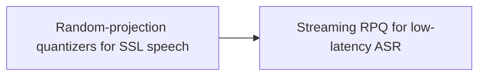

# Idea Spark — skill schema (Phase 1)

> **Issue:** https://github.com/EvoScientist/EvoScientist-WebUI/issues/5
> **Conversation snapshot:** [`issue-5-snapshot.json`](./issue-5-snapshot.json) — refresh with `gh issue view 5 --repo EvoScientist/EvoScientist-WebUI --comments --json title,body,author,createdAt,url,comments | python3 -m json.tool > issue-5-snapshot.json`

## Scope

This document is the canonical contract between the `idea-spark` skill (writer) and the EvoScientist WebUI (reader). It covers **Phase 1 only** — the static graph view with click-to-thread navigation.

Out of scope here, to land in later schema bumps:

- Accept / reject feedback from the UI (Phase 2)
- Interactive graph library replacing Mermaid (Phase 3)
- Multi-thread aggregation strategy beyond per-node `thread_id` provenance (deferred until Phase 1 is in use)

## Memory layout

Idea Spark trees live in the global EvoScientist memory directory — `MEMORIES_DIR` from `EvoScientist/paths.py:51-68` (default `~/.evoscientist/memories/`, overridable via `EVOSCIENTIST_MEMORIES_DIR`).

```
$MEMORIES_DIR/
  idea_spark_tree/
    <graph_id>/
      graph.json   # canonical state — skill writes, WebUI reads
      graph.md     # derived Mermaid view — same skill run writes both
```

`<graph_id>` is **user-given** — the user names the research direction when starting Idea Spark. The skill sanitizes the input to a filesystem-safe form before using it as the directory name:

- lowercase
- replace any run of `[^a-z0-9-]+` with a single `-`
- trim leading and trailing `-`
- cap length at 64 chars
- if the result is empty after sanitization, reject the input

The unsanitized display name is preserved in `graph.json` so the UI can show what the user actually typed.

## `graph.json` — canonical state

Authored by the `idea-spark` skill. The skill MAY read the existing file and update only the fields that changed (no requirement to re-emit unchanged nodes). The atomicity requirement is at the file level, not the content level — see "Update contract" below.

```json
{
  "schema_version": 1,
  "id": "self-supervised-speech",
  "name": "Self-supervised speech recognition",
  "created_at": "2026-06-16T12:00:00Z",
  "updated_at": "2026-06-16T12:34:56Z",
  "nodes": [
    {
      "id": "node-1",
      "parent_id": null,
      "thread_id": "019ebc49-1be5-77f1-835d-2db637ca0a3f",
      "title": "Random-projection quantizers for SSL speech"
    },
    {
      "id": "node-1.1",
      "parent_id": "node-1",
      "thread_id": "019ebc49-1be5-77f1-835d-2db637ca0a3f",
      "title": "Streaming RPQ for low-latency ASR"
    }
  ]
}
```

### Field reference

| Field | Type | Notes |
|---|---|---|
| `schema_version` | number | Always `1` in Phase 1. WebUI checks and warns on unknown values. |
| `id` | string | Sanitized `<graph_id>` (matches the directory name). |
| `name` | string | Unsanitized display name as the user typed it. |
| `created_at` / `updated_at` | RFC 3339 string | UTC. `updated_at` advances on every skill run. |
| `nodes[]` | array | Flat list. Tree structure is derived from `parent_id`. |
| `nodes[].id` | string | **Stable across skill runs.** Once assigned, the skill MUST preserve it when extending the graph. |
| `nodes[].parent_id` | string \| null | `null` for the root. Exactly one root per graph in Phase 1. |
| `nodes[].thread_id` | string | The LangGraph thread that produced this node. Used by the WebUI to click-through to the originating chat. |
| `nodes[].title` | string | One-line node label. The skill MUST escape Mermaid-sensitive characters before emitting — match the convention already in `EvoScientist/skills/paper-graph/scripts/mermaid.py`. |

### Optional node fields (Phase 1, writer-only)

The skill MAY attach the following optional fields to any node. The WebUI **ignores** them in Phase 1 — they are persisted for Phase 2/3 to surface (accept/reject reasoning, click-into-detail panels, paper extraction) without re-running ideation.

| Field | Type | Notes |
|---|---|---|
| `nodes[].description` | string | 2–4 sentence rationale for the node — what's interesting and what the load-bearing tension is. |
| `nodes[].next_action` | string | One-sentence concrete next step a researcher would take. |
| `nodes[].references` | array of string | URLs / arxiv ids anchoring the node. Order is informational. |
| `nodes[].created_at` | RFC 3339 string | UTC. Set once at node creation; never updated. |

Rules:

- All four are **optional**. Absence is meaningful (= not provided), not a schema violation.
- Writers (the `idea-spark` skill) SHOULD attach `created_at` to every new node and SHOULD attach `description` / `next_action` for nodes produced by LLM ideation. `references` is attached only when the writer has them.
- Readers (the WebUI in Phase 1) MUST tolerate both presence and absence of these fields. Unknown fields beyond this list MUST be ignored without erroring.
- Once a node's `id` is fixed, its optional fields MAY be updated by later skill runs — but in Phase 1 the skill is append-only, so this only matters for future phases.

## `graph.md` — derived Mermaid view

The same skill run writes a Mermaid projection alongside `graph.json`. `graph.json` is the source of truth; `graph.md` is convenience. Because it's a pure projection, the skill rewrites this file in full on every run.

Default direction is `LR` to match the existing paper-graph convention (`EvoScientist/skills/paper-graph/scripts/mermaid.py` → `graph LR`).

Suggested template:

````markdown
# {name}


````

Node ids in the Mermaid block **must match** the JSON node ids exactly so the WebUI can map Mermaid-rendered clicks back to the right node. (Mermaid renders the bracketed label as the visible text, so the id itself has no aesthetic cost — it's purely an identifier.)

## Update contract

- Writes are **atomic**: serialize the new content to `graph.json.tmp`, then `rename` to `graph.json`. Same pattern for `graph.md`. This prevents the WebUI from reading a half-written file regardless of whether the skill did a full re-emit or a surgical edit internally.
- `graph.md` is rewritten in full on every run (pure projection of `graph.json`).
- `graph.json` MAY be updated in-place by reading the existing content, modifying fields, and atomically writing the result. The skill chooses.
- If the skill extends an existing graph, it MUST:
  - Preserve every existing node's `id` and `parent_id`.
  - Assign fresh ids only to newly-added nodes.
  - Refresh `updated_at`; keep `created_at`.
- The skill never deletes the directory or files. Cleanup is a user operation.

## Open questions for review

1. **Concurrent skill runs on the same `<graph_id>`.** Two threads invoking `idea-spark` simultaneously will race; the second overwrites the first. Phase 1 punts on this — acceptable for an MVP, but worth flagging if the maintainer wants a lock file or last-writer-wins is fine.
2. **Node-id format.** Free-form (`node-1`, `node-1.1`) or structured to encode provenance (e.g. `<thread-id-prefix>-<n>`)? Mermaid renders the bracketed label, so the id has no visible cost — the choice is purely about debuggability when reading the JSON. Default suggestion: free-form, since `thread_id` already carries provenance separately.
3. **Cross-thread extension semantics.** When a second thread runs idea-spark on the same `<graph_id>`, does it treat existing nodes as read-only context, or can it move / re-parent them? Phase 1 default: read-only context, append only.
4. **Phase 2 schema bump strategy.** Add forward-compatible optional fields to existing nodes (e.g. `status?`), or bump `schema_version: 2` and migrate? Forward-compatible is cheaper; explicit versioning is safer if Phase 2 changes semantics.
